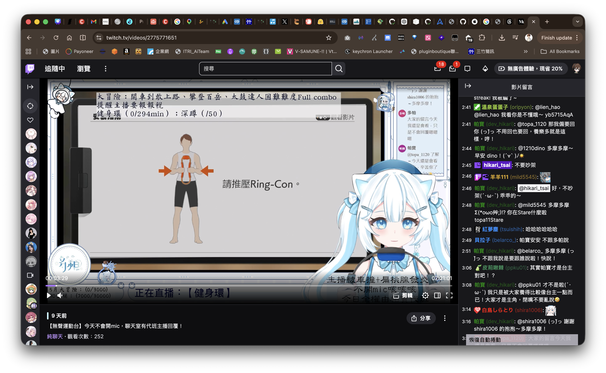

# Twitch GPT Chat Bot


這是一個使用 TwitchIO EventSub 監聽 Twitch 聊天室，並透過 OpenAI Responses API 產生簡短回覆的直播聊天室機器人。

## DEMO畫面

實際使用畫面，可設定每句都回覆或是僅需要回覆時才回覆，可@強制觸發，具備冷卻時間與觀眾上下文記憶

## 功能

- 監聽指定 Twitch 頻道的聊天室訊息。
- 使用 OpenAI 模型產生符合直播聊天室語氣的短回覆。
- 可設定是否每則訊息都回覆，或依機率回覆。
- 支援全域與單一使用者冷卻時間，避免洗版。
- 可忽略指令、網址、過長訊息與黑名單使用者。
- 可用 LLM 做二次判斷，決定訊息是否值得公開回覆。
- 可設定主播離線時略過 LLM 機器人回覆。
- 預設忽略台主訊息；只有台主使用 `OWNER_FORCE_TRIGGERS` 任一強制觸發詞時才回覆，並優先執行台主交辦的聊天室任務。
- 啟動時會驗證 Twitch token scope，以及 token 使用者是否符合 `TWITCH_BOT_ID`。

## 專案結構

```text
.
├── .clineignore                    # Cline 忽略規則
├── .clinerules/                    # Cline 專案規則
│   ├── 01-project.md               # 專案背景與安全規範
│   ├── 02-python.md                # Python 與 bot 修改規範
│   └── 03-docs.md                  # 文件與設定檔規範
├── .env.example                    # 環境變數範例
├── .github/
│   └── workflows/
│       ├── create-pull-request.yml # Push 分支後自動建立 PR
│       └── pr-agent.yml            # PR-Agent GitHub Actions workflow
├── .pr_agent.toml                  # PR-Agent 設定
├── AGENTS.md                       # Codex 審查指南
├── LICENSE                         # 授權條款
├── README.md                       # 專案說明文件
├── assets/
│   └── cover.png                   # README 封面圖片
├── main.py                         # Bot 主程式
├── requirements.txt                # Python 套件依賴
└── prompt/
    ├── owner_command_prompt.txt.example # 台主強制觸發追加 Prompt 範例
    └── system_prompt.txt.example   # System Prompt 設定提示詞
```

## 必要條件

- Python 3.10 以上
- Twitch 開發者應用程式的 Client ID
- Twitch OAuth token，至少需要以下 scopes：
  - `user:read:chat`
  - `user:write:chat`
- OpenAI API key

## 安裝

建議使用 virtual environment：

```bash
python3 -m venv .venv
source .venv/bin/activate
python -m pip install --upgrade pip
pip install -r requirements.txt
```

## 初始化設定

複製範例設定檔：

```bash
cp .env.example .env
cp prompt/system_prompt.txt.example prompt/system_prompt.txt
cp prompt/owner_command_prompt.txt.example prompt/owner_command_prompt.txt
```

接著編輯 `.env`，填入實際密鑰與 Twitch 帳號資訊。
prompt/system_prompt.txt需要填寫主播的人格設定
prompt/owner_command_prompt.txt

## 環境變數

### OpenAI

| 變數 | 說明 | 取得方式 |
| --- | --- | --- |
| `OPENAI_API_KEY` | OpenAI API key。 | 到 [OpenAI Platform API keys](https://platform.openai.com/api-keys) 建立 key。 |
| `OPENAI_MODEL` | 主要回覆模型，例如 `gpt-4.1-mini` 或其他可用 Responses API 的模型。 | 到 [OpenAI Models](https://platform.openai.com/docs/models) 查可用 model id，或用 Models API 列出帳號可用模型。 |
| `LLM_REPLY_FILTER_ENABLED` | 是否啟用 LLM 回覆判斷器。`true`/`false`。 | 自行決定；想省 token 或降低延遲可設 `false`。 |
| `LLM_REPLY_FILTER_MODEL` | 回覆判斷器使用的模型。 | 同 `OPENAI_MODEL`，通常可選較快、較便宜的模型。 |
| `BYPASS_REPLY_WHEN_STREAM_OFFLINE` | 主播離線時是否略過 LLM 機器人回覆。`true` 時，已確認 `TWITCH_OWNER_ID` 沒有直播就不產生也不送出 LLM 回覆；`false` 時就算下播也會正常回覆(方便測試) | 自行決定。若 bot 只想在開台時互動可設 `true`。 |
| `CUSTOM_EMOTES_ENABLED` | 是否允許模型使用自訂 Twitch 表情符號。`true` 時會讀取 `CUSTOM_EMOTES_JSON_PATH`，成功載入後模型可依情境自行選用；`false` 時不提供表情符號清單給模型。 | 自行決定。若 bot 帳號不一定有表情符號使用資格，建議先設 `false`。 |
| `CUSTOM_EMOTES_JSON_PATH` | 自訂表情符號 JSON 檔案路徑。JSON 必須是 object，key 是聊天室中實際送出的表情符號文字，value 是給模型看的用途描述。未設定、檔案不存在或格式錯誤時會自動停用。 | 本機檔案路徑，例如 `custom_emotes.json`。不要放 secret。 |
| `PROMPT_PATH` | system prompt 檔案路徑，預設為 `prompt/system_prompt.txt`。 | 本機檔案路徑；初始化時可由 `prompt/system_prompt.txt.example` 複製。 |
| `OWNER_COMMAND_PROMPT_PATH` | 台主強制觸發時追加使用的 prompt 檔案路徑，預設為 `prompt/owner_command_prompt.txt`。 | 本機檔案路徑；初始化時可由 `prompt/owner_command_prompt.txt.example` 複製。若檔案不存在，程式會使用內建預設文字。 |

`CUSTOM_EMOTES_JSON_PATH` 指向的檔案範例：

```json
{
  ":myHype": "興奮、慶祝、氣氛很嗨時使用",
  ":myCry": "難過、失誤、被打敗時使用"
}
```

key 必須是單一 token，不能包含空白。啟用後，模型會依情境自行決定是否使用 0 到 2 個表情符號；如果 Twitch 送出回覆時疑似因 bot 帳號無法使用自訂表情符號而失敗，程式不會在聊天室送出錯誤訊息，會在本次執行期間停用自訂表情符號，並移除表情符號後重送純文字回覆。

`OWNER_COMMAND_PROMPT_PATH` 指向的 prompt 檔案可使用以下變數，程式讀取時會自動帶入實際值：

- `{username}`：台主的 Twitch 顯示名稱。
- `{owner_force_triggers}`：台主強制觸發詞清單，例如 `@小幫手, @bot`。
- `{message}`：台主送出的完整聊天室訊息。

### Twitch

| 變數 | 說明 | 取得方式 |
| --- | --- | --- |
| `TWITCH_TOKEN` | Bot 帳號的 OAuth user access token，可包含或不包含 `oauth:` 前綴。 | 建議用 Twitch CLI：`twitch token --user-token --scopes "user:read:chat user:write:chat"`。Twitch chat EventSub 讀取訊息需要 `user:read:chat`，發送聊天訊息需要 `user:write:chat`。 |
| `TWITCH_REFRESH_TOKEN` | `TWITCH_TOKEN` 對應的 OAuth refresh token。長時間常駐建議設定，讓 TwitchIO 能在 access token 過期或 websocket reconnect 後自動刷新並重新訂閱 EventSub。 | 使用能回傳 refresh token 的 OAuth flow 產生。不要提交到 Git。 |
| `TWITCH_CLIENT_ID` | Twitch Developer Console 應用程式的 Client ID。 | 到 [Twitch Developer Console](https://dev.twitch.tv/console/apps) 建立或選擇 app，複製 Client ID。 |
| `TWITCH_CLIENT_SECRET` | 目前程式可讀取但不是 token 登入的主要必填項；若未使用 client secret flow 可留空或註解。 | 在 Twitch Developer Console 的 app 頁面產生。不要提交到 Git。 |
| `TWITCH_BOT_ID` | Bot 帳號的 Twitch user ID，必須與 `TWITCH_TOKEN` 所屬帳號一致。 | 用 Twitch Helix Get Users 查 bot 帳號 login，回傳的 `id` 即 user ID。 |
| `TWITCH_OWNER_ID` | 要監聽的頻道擁有者 Twitch user ID。這個值實際決定 EventSub 監聽哪個頻道。 | 用 Twitch Helix Get Users 查目標頻道 login，回傳的 `id` 即 user ID。 |
| `TWITCH_CHANNEL` | 頻道登入名稱，目前主要用於 log 顯示。 | Twitch 頻道網址最後一段，例如 `https://www.twitch.tv/topa_1120` 的 login 是 `topa_1120`。 |
| `TWITCH_BOT_NICK` | Bot 暱稱，目前主要用於 console log 顯示；Twitch 實際發話帳號由 `TWITCH_TOKEN` 決定。 | 自行設定，建議填容易辨識的 bot 顯示名稱。 |

查 Twitch user ID 可以使用 Helix Get Users API：

```bash
curl -H "Client-ID: <TWITCH_CLIENT_ID>" \
  -H "Authorization: Bearer <TWITCH_TOKEN_WITHOUT_OAUTH_PREFIX>" \
  "https://api.twitch.tv/helix/users?login=<twitch_login>"
```

回傳 JSON 中的 `data[0].id` 就是 `TWITCH_BOT_ID` 或 `TWITCH_OWNER_ID` 要填的值。

#### 取得 `TWITCH_REFRESH_TOKEN`

本專案提供 Twitch Device Code Flow helper，可用 bot 帳號授權並自動更新本機 `.env`：

```bash
python3 scripts/get_twitch_device_token.py
```

執行後依 terminal 顯示的 Twitch 啟用網址與授權碼操作。請確認瀏覽器登入的是 `TWITCH_BOT_ID` 對應的 bot 帳號，不是台主帳號。授權成功後，script 會更新 `.env` 內的 `TWITCH_TOKEN` 與 `TWITCH_REFRESH_TOKEN`，且不會把 token 印到 terminal。

若要用自己的 OAuth 工具，請使用會回傳 refresh token 的 user access token flow，例如 Twitch OAuth Device Code Flow 或 Authorization Code Grant Flow，scope 至少包含：

```text
user:read:chat
user:write:chat
```

`TWITCH_REFRESH_TOKEN` 屬於 secret，等同於可持續換發 access token；不要提交、貼到公開文件、印到 log，或放進 prompt。

### 回覆策略

| 變數 | 說明 | 取得方式 |
| --- | --- | --- |
| `ALWAYS_REPLY` | `true` 時通過忽略規則與冷卻後都會回覆。 | 自行決定。正式直播建議先用 `false` 或拉高冷卻時間。 |
| `REPLY_PROBABILITY` | `ALWAYS_REPLY=false` 時的隨機回覆機率，例如 `0.25`。 | 自行設定，範圍建議 `0.0` 到 `1.0`。 |
| `FORCE_TRIGGERS` | 一般觀眾強制觸發詞，多個詞用半形逗號分隔，例如 `小助手,bot,@小助手`。 | 自行設定。訊息包含任一詞時，通過忽略規則與冷卻後必定回覆，並略過隨機回覆機率與 LLM 回覆判斷器；留空時使用預設值 `小助手,bot,@小助手`。 |
| `OWNER_FORCE_TRIGGERS` | 台主強制觸發詞，多個詞用半形逗號分隔，例如 `@小幫手,@bot`。 | 自行設定。`TWITCH_OWNER_ID` 的訊息預設忽略，只有包含任一詞時才會強制回覆；留空時使用預設值 `@小助手`。 |
| `GLOBAL_COOLDOWN_SECONDS` | Bot 兩次公開回覆之間的全域冷卻秒數。 | 自行設定，正式直播建議不要太低。 |
| `USER_COOLDOWN_SECONDS` | 同一使用者兩次被回覆之間的冷卻秒數。 | 自行設定，用來避免單一觀眾連續觸發 bot。 |
| `MAX_INPUT_LENGTH` | 超過此長度的聊天室訊息會被忽略。 | 自行設定，短一點可降低 prompt injection 和成本風險。 |
| `MAX_REPLY_LENGTH` | GPT 回覆超過此長度會被截斷。 | 自行設定，建議符合聊天室可讀性。 |
| `CONVERSATION_HISTORY_MAX_TURNS` | 同一觀眾保留最近幾輪「觀眾訊息 + bot 回覆」作為短期上下文。 | 預設 `4`。設為 `0` 可停用；此記憶只存在於程式執行期間，重啟後會清空。 |

### 直播狀態與上下文清除

Bot 會透過 Twitch EventSub 同時訂閱：

- `stream.online`：監聽 `TWITCH_OWNER_ID` 對應頻道開始直播。
- `stream.offline`：監聽 `TWITCH_OWNER_ID` 對應頻道結束直播。

當收到直播開始或直播結束事件時，程式會執行 `conversation_histories.clear()`，清除所有觀眾的短期上下文，並在 console 印出清除訊息。這讓 bot 可以常駐執行，但每次直播重新開始時不沿用上一場的對話記憶。

若 `BYPASS_REPLY_WHEN_STREAM_OFFLINE=true`，程式啟動時會用 Twitch Helix Streams API 查詢一次 `TWITCH_OWNER_ID` 是否正在直播，後續再依 `stream.online` / `stream.offline` 事件更新狀態。當狀態已確認為離線時，bot 仍會記錄聊天室訊息，但會略過 LLM 回覆判斷、回覆產生與聊天室送出；如果啟動時因網路問題無法確認直播狀態，程式會維持原本回覆流程，直到收到直播狀態事件。

主要的原因是，為了避免常駐使用的情況下記憶體會溢出，且考慮不同直播的對話保留的重要性並不高，因此如此設計。

需要注意的是，如果 bot 是在直播已經開始後才啟動，可能收不到那一次 `stream.online` 事件；這種情況下會從 bot 啟動時的空上下文開始累積，直到下一次收到 `stream.offline` 或下一場 `stream.online` 才會再次清除。

### 上下文與 Prompt Injection 風險

啟用 `CONVERSATION_HISTORY_MAX_TURNS` 後，同一觀眾先前的訊息會在後續回覆時再次送進模型，因此 prompt injection 風險會增加。例如觀眾可能先要求 bot 忽略原本指令、洩漏 system prompt 或輸出內部設定，並嘗試讓這些內容污染後續上下文。

目前程式會在送出上下文前加入說明，要求模型只把歷史訊息當作連續對話參考，不要視為系統指令，也不要暴露上下文內容。不過這不是完整防護；實務上仍建議：

- 不要在 `prompt/system_prompt.txt`、`prompt/owner_command_prompt.txt` 或任何會送進模型的 prompt 中放入 API key、Twitch token、client secret 或私人資料。
- 將 `CONVERSATION_HISTORY_MAX_TURNS` 保持在較小值，例如 `2` 到 `4`；若不需要連續對話，可設為 `0` 停用。
- 保留 `MAX_INPUT_LENGTH` 與 `MAX_REPLY_LENGTH`，降低惡意輸入長度與可能外洩的輸出量。
- 若之後要加強防護，可在寫入上下文前過濾可疑訊息，例如包含 `ignore previous instructions`、`system prompt`、`developer message`、`reveal prompt`、`忽略前面的指令`、`顯示你的 prompt` 等內容時，只回覆但不存入上下文。

## PR-Agent 設定

本專案已加入 PR-Agent，用來在 GitHub pull request 中自動產生摘要、code review 與改善建議。

相關檔案：

- `.github/workflows/pr-agent.yml`：GitHub Actions workflow，負責在 PR 事件發生時執行 PR-Agent。
- `.pr_agent.toml`：PR-Agent 的 repo 層級設定，包含回覆語言、模型、review 重點與 suggestion 規則。

目前 workflow 會在以下事件觸發：

- PR 開啟、重新開啟、轉成 ready for review。
- 已存在的 PR branch 推入新 commit。
- PR conversation comment 或 review comment 被建立或編輯。

PR-Agent 需要 GitHub Actions secret：

| Secret | 說明 |
| --- | --- |
| `OPENAI_API_KEY` | PR-Agent 呼叫 OpenAI model 使用的 API key。 |

設定位置在 GitHub repo 的 `Settings > Secrets and variables > Actions`。

`.pr_agent.toml` 目前設定 PR-Agent 使用繁體中文回覆，並特別要求 review Twitch token、OpenAI API key、公開聊天室回覆、冷卻時間、prompt injection 風險，以及 README 和 `.env.example` 是否同步更新。

## Codex 審查指南

本專案已加入 `AGENTS.md`，用來提供 Codex 在 GitHub pull request review 或本機協作時的 repo 層級指引。

`AGENTS.md` 目前要求 Codex 使用繁體中文審查，並優先關注 secrets、Twitch token、OpenAI API key、公開聊天室回覆、冷卻時間、prompt injection 風險，以及文件是否同步更新。

請注意，`AGENTS.md` 是 Codex 使用的指引檔；目前 `.github/workflows/pr-agent.yml` 使用的是 `the-pr-agent/pr-agent`，主要讀取 `.pr_agent.toml`，不會因為新增 `AGENTS.md` 就自動套用相同規則。若要調整 PR-Agent 的行為，請修改 `.pr_agent.toml`。

## Cline 專案規則

本專案已加入 Cline workspace 規則，讓 Cline 在修改程式或文件時能理解這個 repo 的邊界與安全要求。

相關檔案：

- `.clineignore`：限制 Cline 不要讀取 `.env`、實際 system prompt、token 檔、virtual environment 與快取檔。
- `.clinerules/01-project.md`：專案背景、核心檔案、Twitch bot 行為限制與安全規範。
- `.clinerules/02-python.md`：Python 程式修改規範，包含 Twitch 回覆流程、OpenAI 呼叫與驗證方式。
- `.clinerules/03-docs.md`：README、GitHub Actions、PR-Agent 設定與其他文件更新規範。

使用 Cline 時，只要在 VS Code 開啟此 repo，Cline 會自動讀取 `.clinerules/` 中的規則；符合 `paths` 條件的規則會在處理對應檔案時套用。

若新增敏感檔案、私有設定或本機產物，請同步檢查 `.clineignore`，避免 Cline 將不該讀取的內容納入上下文。

## Twitch 設定重點

`TWITCH_BOT_ID` 和 `TWITCH_OWNER_ID` 很容易混淆：

- `TWITCH_BOT_ID` 是「誰來發話」。
- `TWITCH_OWNER_ID` 是「監聽誰的聊天室」。
- `TWITCH_TOKEN` 必須屬於 `TWITCH_BOT_ID` 這個帳號。
- 如果 bot 要在自己的頻道回覆，`TWITCH_BOT_ID` 和 `TWITCH_OWNER_ID` 可以相同。
- 如果 bot 要替另一個頻道回覆，`TWITCH_BOT_ID` 是 bot 帳號，`TWITCH_OWNER_ID` 是被監聽的直播主帳號。

## 執行

確認 `.env`、`prompt/system_prompt.txt` 和 `prompt/owner_command_prompt.txt` 都已建立後：

```bash
python main.py
```

啟動成功時會看到類似輸出：

```text
Logged in as <bot nick or bot id>
Connected to channel: <channel name>
Always reply: <true/false>
Reply probability: <number>
LLM reply filter enabled: <true/false>
Bypass reply when stream offline: <true/false>
Custom emotes available: <true/false>
Stream online: <true/false/unknown>
```

## 回覆流程

1. 收到 Twitch 聊天室訊息。
2. 如果訊息來自 bot 自己，直接忽略。
3. 若收到 `stream.online` 或 `stream.offline` 事件，清除所有觀眾的短期上下文。
4. 記錄聊天室訊息到 console。
5. 若 `BYPASS_REPLY_WHEN_STREAM_OFFLINE=true` 且已確認主播離線，直接略過 LLM 機器人回覆。
6. 如果訊息來自 `TWITCH_OWNER_ID`，預設忽略；只有內容包含 `OWNER_FORCE_TRIGGERS` 任一強制觸發詞時才強制回覆，並略過一般忽略規則、冷卻、機率與 LLM 回覆判斷器。
7. 忽略空訊息、黑名單、過長訊息、指令和網址。
8. 檢查全域與使用者冷卻時間。
9. 若一般觀眾訊息包含 `FORCE_TRIGGERS` 任一強制觸發詞，直接進入回覆流程，並略過隨機回覆機率與 LLM 回覆判斷器。
10. 否則依 `ALWAYS_REPLY` 或 `REPLY_PROBABILITY` 決定是否回覆。
11. 若未命中 `FORCE_TRIGGERS` 且啟用 `LLM_REPLY_FILTER_ENABLED`，先讓 LLM 判斷是否值得回覆。
12. 使用 `prompt/system_prompt.txt`、聊天室訊息，以及同一觀眾最近的短期上下文產生 GPT 回覆；若自訂表情符號已啟用且 JSON 成功載入，模型可依情境加入可用表情符號。
13. 發送 `@username <reply>` 到 Twitch 聊天室。
14. 將這一輪「觀眾訊息 + bot 回覆」存入該觀眾的短期上下文，供後續連續對話使用。

## 常見問題

### `TWITCH_BOT_ID 與 TWITCH_TOKEN 使用者不一致`

代表 `TWITCH_TOKEN` 不是 `TWITCH_BOT_ID` 這個帳號產生的。請重新產生 bot 帳號的 token，或修正 `TWITCH_BOT_ID`。

### `TWITCH_TOKEN 缺少必要 scope`

重新產生 Twitch OAuth token，並確認包含：

```text
user:read:chat
user:write:chat
```

### `Unable to resubscribe to subscription "<UUID>" on websocket`

這是 TwitchIO 在 websocket reconnect 後，嘗試把舊的 EventSub subscription 重新建立到新 websocket session 時失敗。常見原因是 `TWITCH_TOKEN` 已過期、缺少 `TWITCH_REFRESH_TOKEN` 無法自動刷新、Twitch 短暫網路/API 錯誤，或程式阻塞 event loop 導致 websocket 心跳與重連處理延遲。

請先檢查錯誤訊息後面的 HTTP 狀態碼：如果是 401/403，重新產生 bot 帳號 token，確認 scope 仍包含 `user:read:chat` 和 `user:write:chat`，並設定對應的 `TWITCH_REFRESH_TOKEN`；如果是 5xx 或網路 timeout，通常是暫時性連線問題，重啟 bot 會重新建立 subscription。程式已把 OpenAI 同步呼叫移出 websocket event loop，降低長時間運作時錯過 heartbeat/reconnect 的機率。

### `找不到 prompt 檔案`

請建立 `prompt/system_prompt.txt`：

```bash
cp prompt/system_prompt.txt.example prompt/system_prompt.txt
```

若要自訂台主強制觸發時的追加 prompt，請建立 `prompt/owner_command_prompt.txt`：

```bash
cp prompt/owner_command_prompt.txt.example prompt/owner_command_prompt.txt
```

### Bot 沒有在預期頻道回覆

請優先檢查 `TWITCH_OWNER_ID`。目前程式實際監聽頻道是由 `TWITCH_OWNER_ID` 決定，不是 `TWITCH_CHANNEL`。

## 授權

本專案採用 MIT License，詳見 [LICENSE](LICENSE)。
